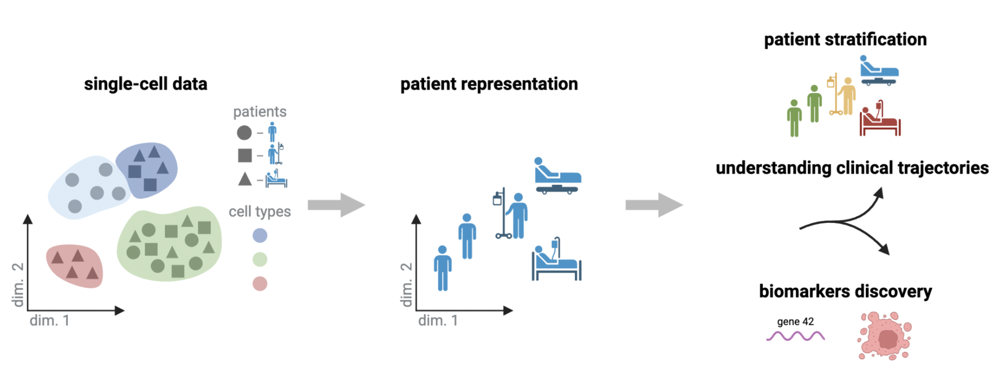

# patpy – sample-level analysis framework for single-cell data


patpy is a toolbox for single-cell data analysis on sample level.

It provides:
- 👨‍⚕️ Interface to sample representation methods (otherwise known as patient representation)
- 📈 Analysis functions to get the most of your data
- 📊 Metrics for sample representation evaluation



# ⚠️ Warning: Development in Progress ⚠️

> **This repository is currently under active development**
> Features and functionalities may change unexpectedly, and some aspects of the project are not yet complete.

---

**Please proceed with caution** and feel free to contribute, but be aware that:

-   The codebase is still evolving.
-   Documentation may be incomplete.
-   Some features may be unstable or subject to change.

If you have any questions or face bugs, feel free to open an [issue](https://github.com/lueckenlab/patpy/issues).

Thank you for your patience and interest. Stay tuned for updates!

---

[![Tests][badge-tests]][link-tests]
[![Coverage][badge-coverage]][link-coverage]
[![PyPI][badge-pypi]][link-pypi]
[![Documentation][badge-docs]][link-docs]
[](https://biocontext.ai/registry)

[badge-tests]: https://img.shields.io/github/actions/workflow/status/lueckenlab/patpy/test.yaml?branch=main
[link-tests]: https://github.com/lueckenlab/patpy/actions/workflows/test.yml
[badge-coverage]: https://codecov.io/gh/lueckenlab/patpy/branch/main/graph/badge.svg
[link-coverage]: https://codecov.io/gh/lueckenlab/patpy
[badge-pypi]: https://img.shields.io/pypi/v/patpy
[link-pypi]: https://pypi.org/project/patpy/
[badge-docs]: https://img.shields.io/readthedocs/patpy

## Getting started

Please refer to the [documentation][link-docs]. In particular, the

-   [API documentation][link-api].

## Installation

You need to have Python 3.9 or newer installed on your system. If you don't have
Python installed, we recommend installing [Mambaforge](https://github.com/conda-forge/miniforge#mambaforge).

There are several alternative options to install patpy:


1. Install the latest release of `patpy` from [`PyPI`](https://pypi.org/project/patpy/):

```bash
pip install patpy
```

2. Install the latest development version:

```bash
pip install git+https://github.com/lueckenlab/patpy.git@main
```

To install specific dependencies for some sample representation tools, use the following command:

```bash
pip install patpy[pilot]
```

All the available dependency groups: `diffusionemd`, `mcp`, `mrvi`, `pilot`, `scpoli`, `wassersteintsne`.

Some sample representation tools depend on packages not published on PyPI. To use them, install the extra and the upstream package from git:

```bash
# pascient
pip install patpy[pascient]
pip install git+https://github.com/genentech/pascient.git@main

# pulsar
pip install git+https://github.com/snap-stanford/PULSAR.git@main
```

## Agent integrations

Export the packaged patpy skills for Claude Code or Codex:

```bash
patpy-export-skills --target claude-code --dest /path/to/project
patpy-export-skills --target codex --dest /path/to/project
patpy-export-biocontext --dest /path/to/output
```

Install the local MCP server entry point and add it to Claude clients:

```bash
pip install patpy[mcp]
claude mcp add patpy --scope project -- patpy-skills-mcp
```

Example Claude and MCP configuration files live under `examples/mcp/`.

## MCP server (`patpy-mcp`)

`patpy-mcp` is a separate, BioContextAI-compatible Model Context Protocol
server that lets any MCP-capable agent (Claude Desktop, Cursor, Goose,
mcp-cli + Ollama, …) search and download single-cell datasets from
public registries — starting with CellxGene Discover. It lives in this
monorepo under [`mcp/`](./mcp/) and follows the
[`biocontext-ai/mcp-server-cookiecutter`](https://github.com/biocontext-ai/mcp-server-cookiecutter)
layout so it is recognisable to BioContextAI maintainers and is
released independently to PyPI as
[`patpy-mcp`](https://pypi.org/project/patpy-mcp/).

```bash
# Run without installing anything (recommended):
uvx patpy-mcp

# Or install from PyPI:
pip install patpy-mcp
patpy-mcp
```

It is designed to chain with sibling BioContextAI servers
([`MaxMLang/cxg-census-mcp`](https://github.com/MaxMLang/cxg-census-mcp) for
Census slice queries and
[`biocontext-ai/anndata-mcp`](https://github.com/biocontext-ai/anndata-mcp) for
AnnData inspection) instead of duplicating them. Configuration snippets
for popular agents and a sample workflow live in
[`docs/mcp.md`](./docs/mcp.md) (online: [patpy.readthedocs.io/en/latest/mcp.html](https://patpy.readthedocs.io/en/latest/mcp.html))
and the package-level documentation in [`mcp/README.md`](./mcp/README.md).

## Release notes

See the [changelog][changelog].

## Contact

For questions and help requests, you can reach out in the [scverse discourse][scverse-discourse].
If you found a bug, please use the [issue tracker][issue-tracker].

## Building docs

1. Install [sphinx](https://www.sphinx-doc.org/en/master/usage/installation.html)

You may need add path to `sphinx-doc` to the `$PATH`

2. Install other `doc` section dependencies from the [pyproject.toml](https://github.com/lueckenlab/patpy/blob/main/pyproject.toml)

3. Build the documentation pages:

```bash
cd docs
make html
```

4. Open `docs/_build/html/index.html`

## Citation

Preprint is coming soon. So far, you can refer to this repository as following:

### APA

Shitov, V. (2024). patpy – sample-level analysis framework for single-cell data (Version 0.10.0) [Computer software]. https://github.com/lueckenlab/patpy/

### BibTeX

```bibtex
@misc{shitov_patpy_2024,
  author = {Shitov, Vladimir},
  title = {patpy – sample-level analysis framework for single-cell data},
  year = {2024},
  url = {https://github.com/lueckenlab/patpy/},
  note = {Version 0.15.2}
}
```

[scverse-discourse]: https://discourse.scverse.org/
[issue-tracker]: https://github.com/lueckenlab/patpy/issues
[changelog]: https://patpy.readthedocs.io/en/latest/changelog.html
[link-docs]: https://patpy.readthedocs.io
[link-api]: https://patpy.readthedocs.io/en/latest/api/index.html
